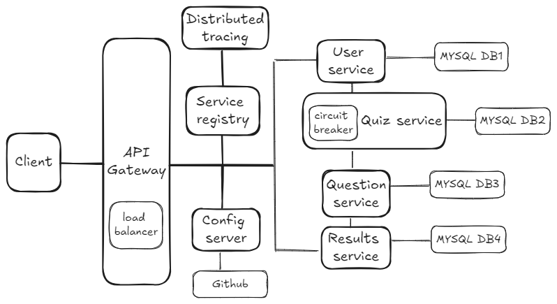

# Getting Started

### Project Architecture

#### Download maven from [here](https://maven.apache.org/download.cgi?.)

### Order of execution
- Service Discovery
- Config Server
- Users Service
- Quiz Service
- Question Service
- Results Service
- API Gateway

### To build a service
cd into the service
```
mvn clean install -DskipTests
```

### To run a service
cd into the service
```
mvn spring-boot:run
```

NOTE: Distributed tracing and Circuit breaker is under development

Import the 'quiz microservices project.postman_collection' file provided inside postman to view API endpoints
